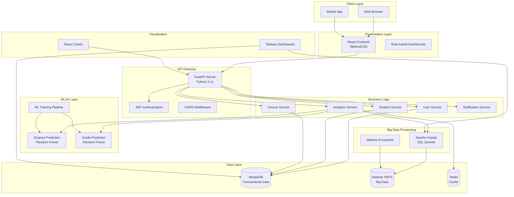
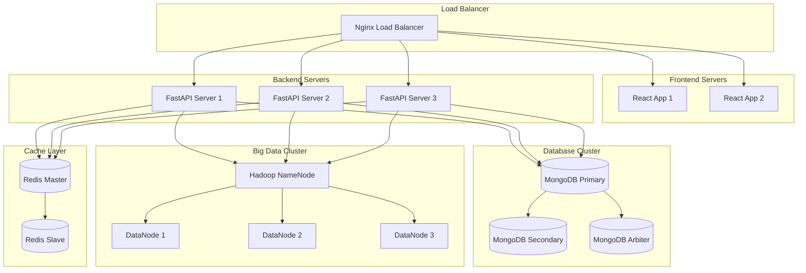
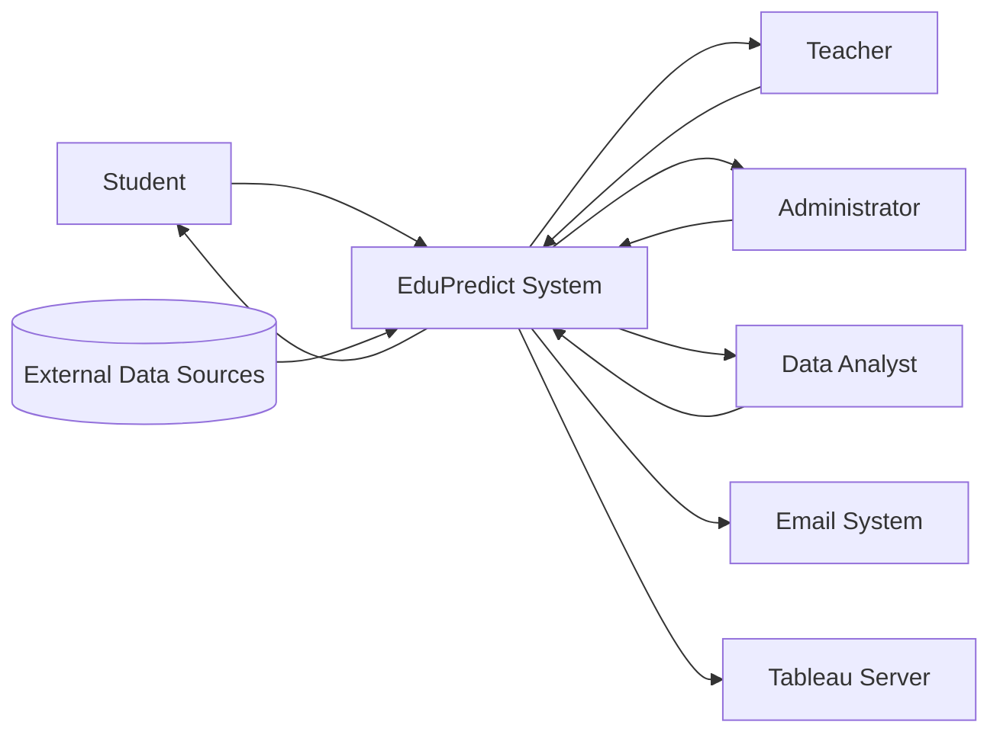
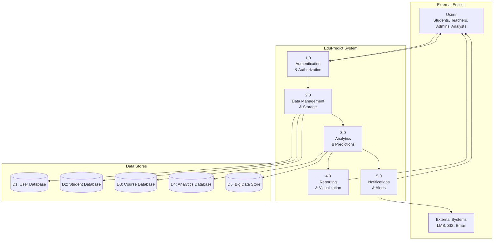
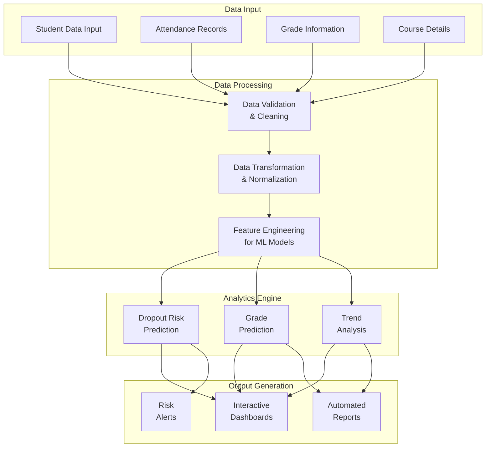
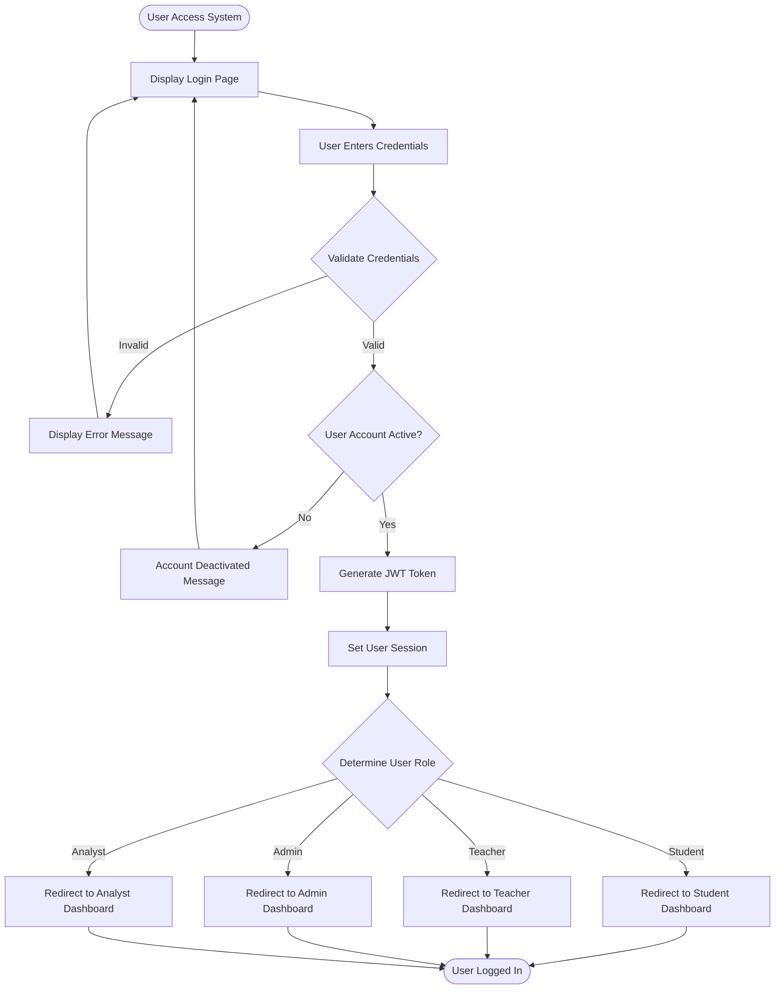
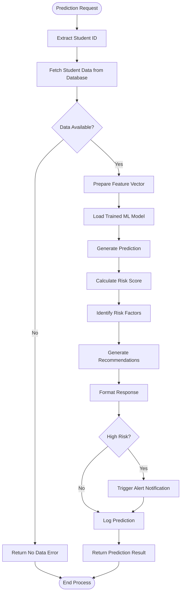
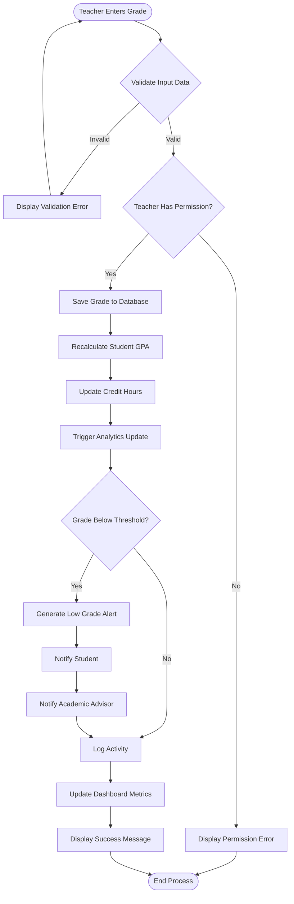
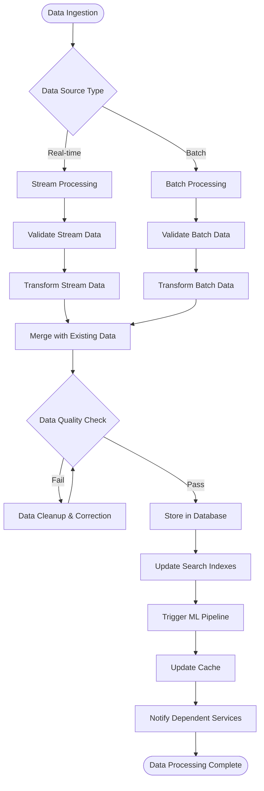

# EduPredict - System Diagrams and Flowcharts

## Table of Contents
1. [System Architecture Diagram](#1-system-architecture-diagram)
2. [Data Flow Diagrams](#2-data-flow-diagrams)
3. [Process Flowcharts](#3-process-flowcharts)
4. [Database Schema Diagrams](#4-database-schema-diagrams)
5. [User Journey Flowcharts](#5-user-journey-flowcharts)
6. [Machine Learning Pipeline Diagrams](#6-machine-learning-pipeline-diagrams)

---

## 1. System Architecture Diagram

### 1.1 High-Level Architecture

### 1.2 Deployment Architecture

---

## 2. Data Flow Diagrams

### 2.1 Level 0 - Context Diagram

### 2.2 Level 1 - System Overview

### 2.3 Level 2 - Detailed Data Flow

---

## 3. Process Flowcharts

### 3.1 User Authentication Flow

### 3.2 Dropout Prediction Process

### 3.3 Grade Entry and Processing Flow

### 3.4 Data Processing Pipeline Flow

